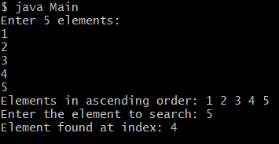

# TITLE: 3b.)  Implementing Binary Search Algorithm
```
import java.util.Scanner;
class BinarySearch {

	int list[];
	int key;
	int size;

	BinarySearch(int size) {

		list= new int[size];
		key = -1;
		this.size=size;

 	}
 
 	void setList() {

			Scanner sc = new Scanner(System.in);
			System.out.println("Enter the list items in Ascending Order.");


			for( int i = 0; i < size; i++) {
	
				System.out.print("Enter the value of " + (i + 1) + " item: ");
				list[i] = sc.nextInt();
			}
			sc.close();

	}

	void getList() {

		for(int i = 0; i < size; i++) 
		System.out.print(list[i] + ", "); System.out.println("\b\b.");

	}

	int binarySearch(int key) {

		int low = 0; int high = list.length; int mid = 0;

		while(low < high) {

			mid = (low + high) / 2;

			if(list[mid] == key) {
				break;
			}

			else if(list[mid] < key) {

				low = mid + 1;
			}

			else
				high = mid + 1;

		}

		return list[mid]==key ? mid : -1 ;

	}

}
```

Main.java


import java.util.Scanner;
class Main {

	public static void main(String args[]) {

		
		BinarySearch bs = new BinarySearch(10);
		bs.setList();
		bs.getList();


	int index = bs.binarySearch(10);		
	if(index == -1 )
			System.out.println("Key item does not exit");

		else
			System.out.println("key item exist at index: " + index);

	}

}
# output

