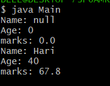

# TITLE 3a.) Implement constructor overloading in JAVA
 ```
 class Student {
	String name;
	int age;
	double marks;
 Student() {
  }
	Student(String name, int age, double marks) {
		this.name=name;
		this.age=age;
		this.marks=marks;
	}
	void display() {
		System.out.println("Name: "+name);
		System.out.println("Age: "+age);
		System.out.println("marks: "+marks);
	}
}
```
Main.java
````
 class Main {

	public static void main(String args[]) {

		Student std = new Student();
		std.display();

		Student std1 = new Student("Hari", 40, 67.8);
		std1.display();

	}
}
```
# output

# TITLE: 3b.)  Implementing Binary Search Algorithm
```
import java.util.Scanner;
class BinarySearch {

	int list[];
	int key;
	int size;

	BinarySearch(int size) {

		list= new int[size];
		key = -1;
		this.size=size;

 	}
 
 	void setList() {

			Scanner sc = new Scanner(System.in);
			System.out.println("Enter the list items in Ascending Order.");


			for( int i = 0; i < size; i++) {
	
				System.out.print("Enter the value of " + (i + 1) + " item: ");
				list[i] = sc.nextInt();
			}
			sc.close();

	}

	void getList() {

		for(int i = 0; i < size; i++) 
		System.out.print(list[i] + ", "); System.out.println("\b\b.");

	}

	int binarySearch(int key) {

		int low = 0; int high = list.length; int mid = 0;

		while(low < high) {

			mid = (low + high) / 2;

			if(list[mid] == key) {
				break;
			}

			else if(list[mid] < key) {

				low = mid + 1;
			}

			else
				high = mid + 1;

		}

		return list[mid]==key ? mid : -1 ;

	}

}
```

Main.java

```
import java.util.Scanner;
class Main {
      public static void main(String args[]) {

		
		BinarySearch bs = new BinarySearch(10);
		bs.setList();
		bs.getList();


	int index = bs.binarySearch(10);		
	if(index == -1 )
			System.out.println("Key item does not exit");

		else
			System.out.println("key item exist at index: " + index);

	}

}
```
# output

# TITLE: 3c.) Sorting Element using Bubble Sort
```
 class BubbleSort {

	void bubbleSort(int arr[]) {

		int n = arr.length;
		int temp = 0;

		for(int i=0 ; i < n-1 ; i++) {

			for(int j=0; j<n-i-1; j++) {

				if(arr[j] > arr[j+1]) {

					temp = arr[j+1];
					arr[j+1] = arr[j];
					arr[j] = temp;

				}
			}
		}

	}

}
```
Main.java
```
import java.util.Scanner;
 class Main {
	
	public static void main(String args[]) {


		System.out.print("Enter the size of array: ");
		Scanner sc = new Scanner(System.in);
		int size = sc.nextInt();

		int integer[] = new int[size];

		for(int i = 0; i < size; i++) {

			System.out.print("Enter the value of integer at index " + (i+1) + ":"); 
			integer[i] = sc.nextInt();
		}

		BubbleSort bs = new BubbleSort();
		bs.bubbleSort(integer);


		System.out.print("The Sorted integer: ");

		for(int i = 0; i < size; i++)
		System.out.print(integer[i] + ", ");

		System.out.println("\b\b.");
    }

}
```
# output

