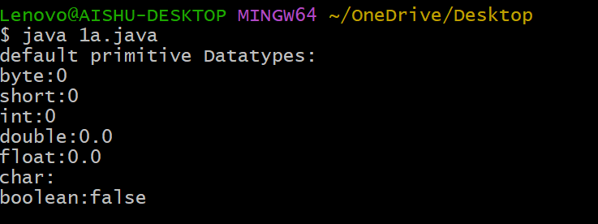

#experiment1
## TITLE: 1a.) Display the Primitive datatypes 
```
class Datatypes{
static byte b;
static short s;
static int i;
static double d;
static float f;
static char c;
static boolean bool;
public static void main(String[]args) {
System.out.println("default primitive Datatypes:");
System.out.println("byte:"+b);
System.out.println("short:"+s);
System.out.println("int:"+i);
System.out.println("double:"+d);
System.out.println("float:"+f);
System.out.println("char:"+c);
System.out.println("boolean:"+bool);
}
}
```
# OUTPUT

